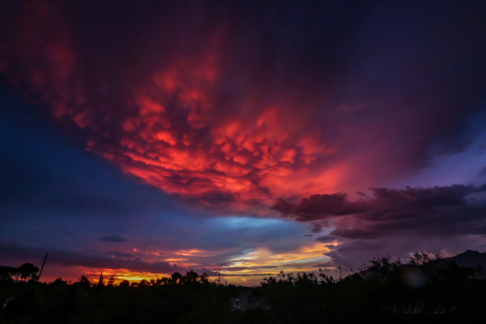

<p style="font-family: arial; font-size:27pt; font-style:bold; color:black"> CHRISTY FIERROS </p>

{width=30%}
I am a masters student studying Land Use and Environmental Planning at the University of North Carolina at Chapel Hill. My interests lie at the intersection of environmental justice, 

Currently, I work as a research assistant on a project aimed to better 

I have experience working with various organizations; ranging from local governments as a GIS cartographer, universities, non-profits as an AmeriCorps garden and food educator, and more. I have been fascinated with the natural world throughout my life and my curiosity has centered around understanding the socio-economic and political forces that shape environmental problems. My goal is to have a career in which I can make a positive impact impact on communities and 

I received my B.A. in Environmental Studies and B.S. in Geography from the University of Arizona.


 <button type="button"> View my CV </button> 


ArcGIS Story Map 

[Link](https://storymaps.arcgis.com/stories/d3949a65428440819c0c149000441593?play=true&speed=medium)

### Markdown

Markdown is a lightweight and easy-to-use syntax for styling your writing. It includes conventions for

```markdown
Syntax highlighted code block

# Header 1
## Header 2
### Header 3

- Bulleted
- List

1. Numbered
2. List

**Bold** and _Italic_ and `Code` text


```
